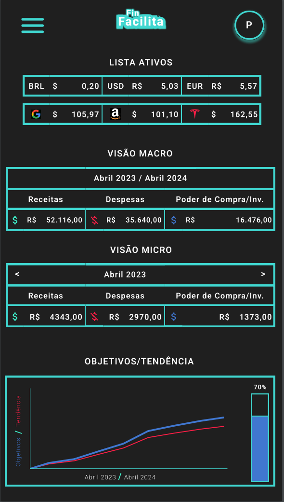
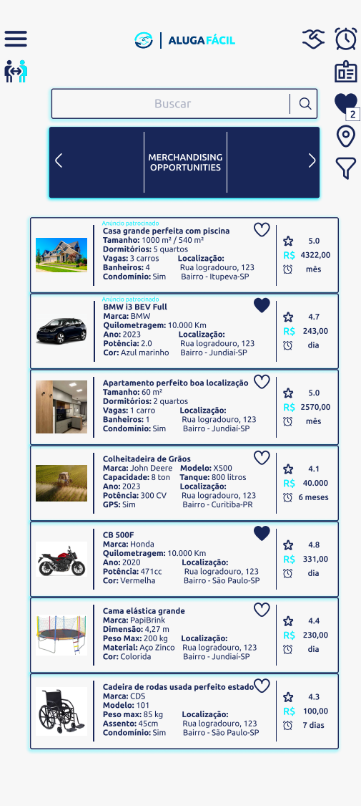

<h1 align="center">
   Rodrigo Pazian's GitHub Stats
</h1>

  

  <a href="https://github.com/rodrigopazian/github-readme-stats">
  
    

  

<h1 align="center">
  Rodrigo Pazian's GitHub Projects
</h1>

  

<h3 align="center">FIAP FINTECH PROJECT - FINFACILITA:</h3>

  

<h3 align="center">FIAP BRQ PROJECT - ALUGAFÁCIL:</h3>

  

